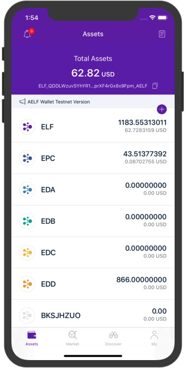
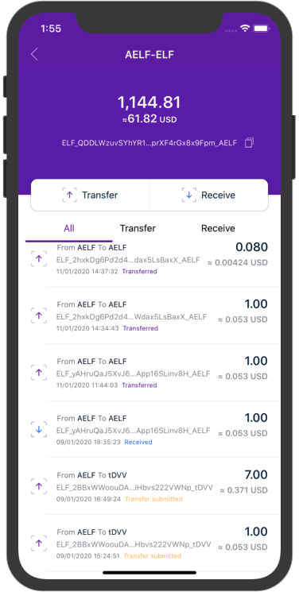
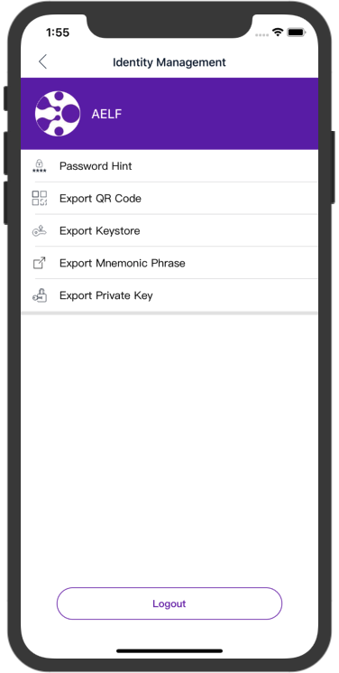

<p align="center">
    
    <br>
    <br>
	 <a href="https://developer.apple.com/iOS">
       
    </a>
    <a href="https://swift.org">
		
    </a>
	<a href="https://developer.apple.com/xcode">
		
    </a>
    <a href="https://developer.apple.com/macOS">
       
    </a>
	<a href="https://opensource.org/licenses/MIT">
		
    </a>
</p>

本项目为 [AELF](https://aelf.io) iOS app 开源项目。

AELF 是一个区块链系统，旨在通过使用侧链和灵活的设计实现可扩展性和可扩展性。为了支持多个用例，AELF 通过提供易于使用的工具和框架来扩展/定制系统，以便定制链并编写智能合约，从而尽可能简化。AELF 最终将支持各种语言，让开发人员选择他们最熟悉的语言。

有关更多信息，请访问以下链接：

* [官方网站](https://aelf.io)
* [官方文档](https://docs.aelf.io/v/dev/)
* [白皮书](https://grid.hoopox.com/aelf_whitepaper_EN.pdf?v=1) 

## 📱预览

|资产|侧链|交易|市场|发现|身份|
|:---:|:---:|:---:|:---:|:---:|:---:|
|||||||


## 💻开发环境

- iOS 9.0+
- macOS 10.14+ 
- Xcode 9.0+
- Swift 4.0+

## ⚔️APP 功能

- [x] 创建/导入钱包
- [x] 添加/编辑资产
- [x] AELF 主链及侧链的跨链转账/收款
- [x] AELF 助记词/Keystore/私钥/二维码导出
- [x] 主流币市场行情/K线
- [x] 交易消息通知

## ⌨️技术
- [x] 高效的异步编程框架 ([RxSwift](https://github.com/ReactiveX/RxSwift) and MVVM)
- [x] 强大的网络框架 ([Moya](https://github.com/Moya/Moya), [ObjectMapper](https://github.com/tristanhimmelman/ObjectMapper))
- [x] 比特币协议框架 ([BitcoinKit](https://github.com/yenom/BitcoinKit))
- [x] RSA 加密算法 ([SwiftyRSA](https://github.com/TakeScoop/SwiftyRSA))
- [x] 自定义转场动画 ([Hero](https://github.com/HeroTransitions/Hero))
- [x] Crash 捕获与使用统计 ([Bugly](https://bugly.qq.com/v2/))
- [x] 安全的数据存储框架 ([KeychainSwift](https://github.com/evgenyneu/keychain-swift))


## 🔧工具
- [x] [Brew](https://github.com/Homebrew/brew) - `macOS` 必不可少的包管理器
- [x] [JSONExport](https://github.com/Ahmed-Ali/JSONExport) - `macOS` 平台快速将 `JSON` 转 `Model` 的开发框架
- [x] [Flex](https://github.com/Flipboard/FLEX) - `iOS` 调试与诊断工具
- [x] [Sourcetree](https://www.sourcetreeapp.com) - 免费的 `Git` 客户端，支持 `macOS` 和 `Windows`
- [x] [Postman](https://www.getpostman.com) - 用于测试 `Web` 服务的强大客户端


## ⚒编译和运行

运行本项目前，请确保已通过 `brew` 安装`autoconf automake libtool`,

安装命令： 

> `brew install autoconf automake libtool`

然后 **git clone** 下载本项目后，打开终端，进入项目 **Podfile** 所在目录，

执行以下命令：

> `pod install`

安装本项目所有依赖框架，完成后，双击`AelfApp.xcworkspace` 打开并运行项目。

> `BitcoinKit` 由于依赖 `autoconf automake libtool`，所以校验安装时间会稍长。

## API Key
项目运行后，访问接口需要 PubKey 加密，在项目的 `Configure.plist` 中配置。如有必要，你可以通过 [issue](https://github.com/AElfProject/aelf-wallet-ios/issues) 来申请一个 PubKey。


## 📁项目结构

```
├── Classes
│   ├── AppDelegate	# 启动入口
│   ├── Base		# 基类
│   ├── Common		# 通用
│   ├── Extensions	# 扩展
│   ├── Libs		# 第三方
│   ├── Utility		# 工具类
│   ├── Modules		# 业务模块
│	 	├── Assets	# 资产
│   	├── Discover# 发现
│   	├── Market	# 行情
│   	├── Setting	# 设置
│   	└── Wallet	# 钱包
└── Resource		# 资源文件
```


## ✉️ 反馈

### 报告问题

我们目前只使用 GitHub 来跟踪问题，功能请求和拉取请求。如果您不熟悉这些工具，请查看 [GitHub](https://help.github.com/en) 文档。 

### Bug 反馈

如果您在我们的项目中发现了一个 Bug，请打开 GitHub issue，反馈并提交此问题，但首先：

* 请在 GitHub issue 中搜索是否已存在此问题；
* 在反馈时提供尽可能多的信息；如：iOS 系统版本，AELF 的版本，如何重现...


## 📄 License	

AELF 使用 MIT 许可证，详情可见 [LICENSE](LICENSE) 。